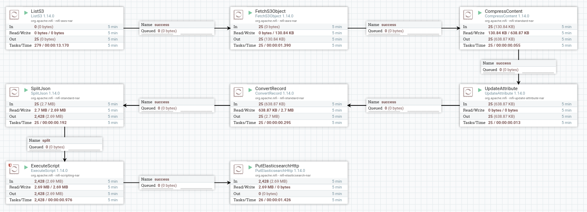

## Overview
This uses Apache NiFi to ship logs from S3 to Elasticsearch. The main use case is to have logs stored in a single location so that 1) a single query language is used and 2) visualisations can be created.

NiFi comes with a huge amount of built-in processors: the complete list can be found [here](https://www.nifi.rocks/apache-nifi-processors).

NiFi also has a useful checkpointing feature that tracks and skips any files it has processed. The input and output of each of the flow's processors is accessible from the NiFi console, which greatly eases development and debugging.

## Quickstart
1. Download and run Apache NiFi: (e.g. `./nifi-1.14.0/bin/nifi.sh start`)
2. Open the NiFi console (`https://localhost:8443/nifi`) and import a flow template from the `flows` directory in this repository.
3. Add an AWS access/secret key or set IAM role-awareness in the S3 processors.
4. Start Elasticsearch: `docker-compose up` (you may have to change the max_map_count kernel parameter on your host for this to work: `sudo sysctl -w vm.max_map_count=262144`)
5. Start the flow from the NiFi console and see the data come through to Elasticsearch.

## Example

A flow that processes CloudFront logs and ships them to Elasticsearch.
